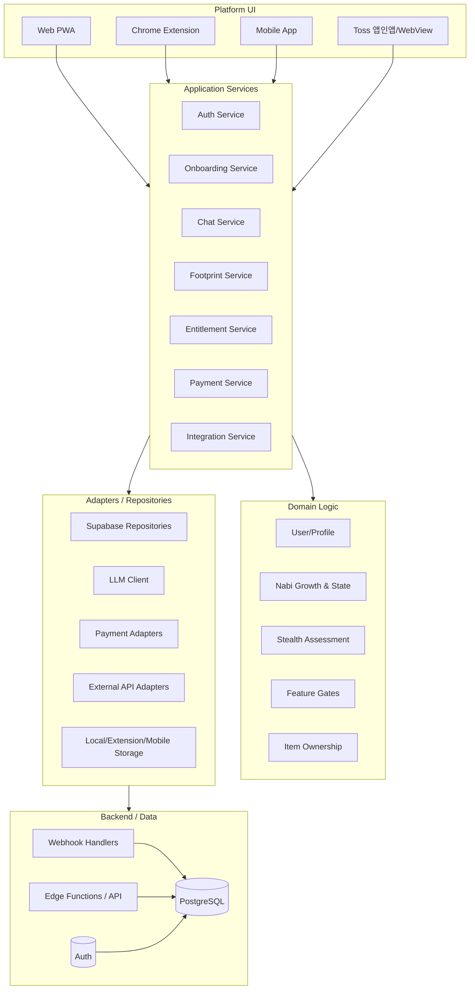

# 안녕나비야 - 확장 아키텍처 및 권한 시스템 설계

> **문서 목적**: 현재 웹앱 기반 MVP를 유지하면서, 이후 Chrome Extension, 모바일 앱, Toss 앱인앱, 외부 API 연동, 인앱결제/구독/아이템 구매까지 확장하기 쉬운 구조를 정의한다.  
> **핵심 방향**: 플랫폼 UI는 달라져도 사용자, 나비, 대화, 발자국, 권한, 결제, 외부 연동 규칙은 공통 서비스 계층에서 일관되게 관리한다.

---

## 1. 설계 원칙

### 1.1 플랫폼보다 도메인을 먼저 분리한다

현재는 웹앱(PWA)이 시작점이지만, 장기적으로는 여러 플랫폼이 같은 핵심 기능을 사용해야 한다.

```text
Web PWA
Chrome Extension
Mobile App
Toss 앱인앱/WebView
        ↓
공통 Application Service
        ↓
Domain Logic
        ↓
Supabase / LLM / 결제 / 외부 API
```

플랫폼별 화면과 입력 방식은 달라도 아래 규칙은 하나로 유지한다.

- 사용자 프로필
- 나비 프로필과 성장 상태
- 대화/발자국 저장 규칙
- Stealth Assessment 분석 규칙
- 무료/유료 권한 판단
- 유료 아이템 소유 판단
- 외부 API 연동 규칙
- 결제 이벤트 처리 규칙

### 1.2 외부 서비스는 Adapter로 감싼다

외부 API나 결제사는 언제든 바뀔 수 있다. 앱 코드가 특정 업체 SDK나 API URL에 직접 묶이지 않도록 한다.

```text
나쁜 예:
fetch("https://some-provider.com/api/...")

좋은 예:
healthIntegrationService.syncSleepData(userId)
paymentService.createCheckoutSession(userId, productId)
```

실제 구현은 Adapter가 담당한다.

```text
healthIntegrationService
  ├─ AppleHealthAdapter
  ├─ GoogleFitAdapter
  ├─ FitbitAdapter
  └─ ManualInputAdapter

paymentService
  ├─ TossPaymentsAdapter
  ├─ StripeAdapter
  ├─ AppleInAppPurchaseAdapter
  └─ GooglePlayBillingAdapter
```

### 1.3 프론트엔드 표시와 백엔드 권한 검사는 모두 필요하다

프론트엔드의 버튼 숨김은 UX를 위한 장치다. 실제 보안은 서버/API/Edge Function에서 다시 확인해야 한다.

```text
프론트엔드:
- 유료 기능 버튼 노출 여부
- 업그레이드 안내 표시

백엔드:
- 실제 API 실행 전 권한 확인
- LLM 사용량 제한
- 결제/아이템 소유 검증
```

### 1.4 결제 수단이 아니라 권한을 기준으로 기능을 열어준다

앱 내부에서는 사용자가 Toss로 결제했는지, Apple IAP로 결제했는지 직접 판단하지 않는다. 최종적으로는 `entitlements`와 `user_items`를 보고 기능을 열어준다.

```text
결제 이벤트
  → 검증
  → entitlement 또는 item 지급
  → 앱은 canUse / hasItem으로 판단
```

---

## 2. 목표 아키텍처



---

## 3. 코드 구조 제안

현재 MVP는 Vanilla PWA 중심이므로 한 번에 대규모 리라이트하지 않고, 기능 단위로 점진 분리한다.

```text
src/
  domain/
    nabi-growth.js
    assessment.js
    feature-gates.js
    entitlement.js
    item-ownership.js

  services/
    auth-service.js
    onboarding-service.js
    chat-service.js
    footprint-service.js
    entitlement-service.js
    payment-service.js
    integration-service.js

  adapters/
    supabase/
      supabase-client.js
      profile-repository.js
      footprint-repository.js
      entitlement-repository.js
      item-repository.js
    llm/
      navi-chat-client.js
    payments/
      toss-payments-adapter.js
      apple-iap-adapter.js
      google-play-adapter.js
    integrations/
      health-api-adapter.js
      calendar-api-adapter.js

  platform/
    web/
      app.js
      views/
    chrome-extension/
    mobile/
    toss/
```

### 3.1 현재 코드에서 먼저 분리할 대상

| 현재 역할 | 분리 위치 | 이유 |
|----------|-----------|------|
| 유대감 계산 | `domain/nabi-growth.js` | 플랫폼과 무관한 순수 로직 |
| 메시지 분석/발자국 초안 생성 | `domain/assessment.js`, `services/footprint-service.js` | 테스트와 재사용 용이 |
| Supabase 프로필/발자국 저장 | `adapters/supabase/*-repository.js` | DB 교체와 테스트 용이 |
| 로그인 후 이름 설정 | `services/onboarding-service.js` | Web/Mobile/Extension에서 재사용 |
| LLM 호출 | `adapters/llm/navi-chat-client.js` | 모델/벤더 교체 용이 |
| 권한 판단 | `domain/feature-gates.js`, `services/entitlement-service.js` | 무료/유료 기능 확장 대비 |

---

## 4. 계정 권한 시스템 설계

### 4.1 계정 상태

앱에서 다룰 기본 계정 상태는 아래처럼 구분한다.

| 상태 | 설명 | 저장 위치 |
|------|------|-----------|
| `guest` | 로그인 없이 둘러보기 | Local Storage 또는 기기 저장소 |
| `free` | 로그인한 무료 사용자 | Auth + DB |
| `premium` | 유료 구독 권한 보유 사용자 | `entitlements` |
| `admin` | 운영/관리 권한 사용자 | 별도 role 또는 admin claim |

`premium`은 `profiles.plan` 같은 단일 필드로만 관리하지 않는다. 구독, 기간제 이용권, 이벤트 지급, 인앱결제 복구 등 다양한 경로가 생기기 때문이다.

### 4.2 권한 테이블: `entitlements`

```sql
create table public.entitlements (
  id uuid primary key default gen_random_uuid(),
  user_id uuid not null references auth.users(id) on delete cascade,
  entitlement_key text not null,
  status text not null check (status in ('active', 'inactive', 'expired', 'revoked')),
  source text not null,
  provider text,
  provider_reference_id text,
  starts_at timestamptz not null default now(),
  ends_at timestamptz,
  created_at timestamptz not null default now(),
  updated_at timestamptz not null default now(),
  unique (user_id, entitlement_key, source, provider_reference_id)
);
```

예시 `entitlement_key`:

```text
premium_monthly
premium_yearly
advanced_analysis
long_term_memory
external_health_sync
custom_nabi_room
```

### 4.3 기능 게이트: `feature_gates`

기능별로 필요한 권한을 정의한다.

```text
feature_key: advanced_analysis
required_entitlement: advanced_analysis 또는 premium_monthly
fallback: upgrade_prompt
```

코드에서는 항상 공통 함수로 판단한다.

```js
canUse(userContext, "advanced_analysis");
canUse(userContext, "external_health_sync");
canUse(userContext, "long_term_memory");
```

### 4.4 유료 아이템 소유: `user_items`

구독형 권한과 별도로, 한 번 구매하면 소유하는 아이템이 필요할 수 있다.

```sql
create table public.user_items (
  id uuid primary key default gen_random_uuid(),
  user_id uuid not null references auth.users(id) on delete cascade,
  item_key text not null,
  status text not null check (status in ('active', 'inactive', 'refunded', 'revoked')),
  source text not null,
  provider text,
  provider_reference_id text,
  purchased_at timestamptz not null default now(),
  expires_at timestamptz,
  created_at timestamptz not null default now(),
  unique (user_id, item_key, source, provider_reference_id)
);
```

예시 `item_key`:

```text
nabi_skin_calico
nabi_skin_black
room_theme_spring
room_theme_night
voice_pack_soft
sticker_pack_basic
```

코드에서는 아래처럼 판단한다.

```js
hasItem(userContext, "nabi_skin_calico");
hasItem(userContext, "room_theme_spring");
```

---

## 5. 무료/유료 기능 예시

| 기능 | Guest | Free | Premium | 비고 |
|------|-------|------|---------|------|
| 기본 대화 | 가능 | 가능 | 가능 | Guest는 로컬 저장 |
| Google 로그인 | 가능 | 가능 | 가능 | 인증 후 클라우드 저장 |
| 기본 발자국 저장 | 로컬 | 가능 | 가능 | Free는 제한 개수 가능 |
| 장기 대화 기억 | 불가 | 제한 | 가능 | LLM 비용 관리 필요 |
| 고급 감정/생활 패턴 리포트 | 불가 | 미리보기 | 가능 | 권한 체크 필수 |
| 외부 건강 API 연동 | 불가 | 불가 또는 제한 | 가능 | 민감 데이터 동의 필요 |
| 나비 스킨/방 테마 | 기본만 | 구매 아이템 | 구매/포함 가능 | `user_items` |
| 광고/프로모션 제거 | 해당 없음 | 제한 | 가능 | 정책에 따라 결정 |

---

## 6. 결제 및 인앱결제 설계

### 6.1 결제 흐름

```text
1. 사용자가 업그레이드 또는 아이템 구매 클릭
2. Payment Service가 상품/권한 정보를 조회
3. 결제 Provider별 Adapter가 결제 세션 생성
4. 결제 완료 후 Provider webhook 수신
5. webhook 원본을 payment_events에 저장
6. 이벤트 검증 및 중복 처리
7. entitlements 또는 user_items 지급
8. 앱이 /me/entitlements 또는 동기화 API로 최신 권한 반영
```

### 6.2 결제 이벤트 원장: `payment_events`

결제는 반드시 이벤트 원장을 남긴다. 환불, 취소, 구독 갱신, 중복 webhook 처리에 필요하다.

```sql
create table public.payment_events (
  id uuid primary key default gen_random_uuid(),
  provider text not null,
  provider_event_id text not null,
  event_type text not null,
  user_id uuid references auth.users(id) on delete set null,
  product_key text,
  raw_payload jsonb not null,
  processed_at timestamptz,
  processing_status text not null default 'pending'
    check (processing_status in ('pending', 'processed', 'ignored', 'failed')),
  created_at timestamptz not null default now(),
  unique (provider, provider_event_id)
);
```

### 6.3 Provider별 고려사항

| Provider | 사용처 | 핵심 고려사항 |
|----------|--------|---------------|
| Toss Payments | 웹 결제, Toss 연동 가능성 | 결제 승인/취소/환불 webhook 처리 |
| Stripe | 해외 결제 가능성 | Subscription lifecycle 이벤트 처리 |
| Apple In-App Purchase | iOS 앱 | App Store Server Notification, receipt 검증 |
| Google Play Billing | Android 앱 | Real-time Developer Notification, purchase token 검증 |
| Toss 앱인앱 | Toss 환경 | Toss 정책과 WebView/OAuth redirect 정책 확인 필요 |

---

## 7. 외부 API 연동 설계

### 7.1 연동 대상 예시

```text
건강 데이터:
- Apple Health
- Google Fit / Health Connect
- Samsung Health
- Fitbit

생활 데이터:
- Calendar
- Todo / Notion
- Weather
- Sleep tracker
```

### 7.2 연동 연결 테이블: `integration_connections`

```sql
create table public.integration_connections (
  id uuid primary key default gen_random_uuid(),
  user_id uuid not null references auth.users(id) on delete cascade,
  provider text not null,
  status text not null check (status in ('active', 'inactive', 'revoked', 'error')),
  scopes text[] not null default '{}',
  access_token_ref text,
  refresh_token_ref text,
  connected_at timestamptz not null default now(),
  last_synced_at timestamptz,
  created_at timestamptz not null default now(),
  updated_at timestamptz not null default now(),
  unique (user_id, provider)
);
```

민감한 토큰은 클라이언트나 일반 테이블에 그대로 두지 않는다. Vault, KMS, 서버 환경 변수, 암호화 저장소를 우선 검토한다.

### 7.3 외부 이벤트 저장: `external_events`

외부 API에서 받은 원본 이벤트를 별도로 저장하면 재처리와 디버깅이 쉬워진다.

```sql
create table public.external_events (
  id uuid primary key default gen_random_uuid(),
  user_id uuid references auth.users(id) on delete cascade,
  provider text not null,
  event_type text not null,
  event_date date,
  normalized_payload jsonb,
  raw_payload jsonb,
  created_at timestamptz not null default now()
);
```

---

## 8. API 설계 방향

MVP에서는 Supabase 클라이언트를 직접 쓰더라도, 장기적으로는 플랫폼별 앱이 같은 API 계약을 사용하도록 정리한다.

### 8.1 사용자/권한 조회

```text
GET /me
GET /me/entitlements
GET /me/items
```

응답 예시:

```json
{
  "user": {
    "id": "uuid",
    "email": "test@example.com",
    "account_type": "free"
  },
  "entitlements": [
    {
      "key": "premium_monthly",
      "status": "active",
      "ends_at": "2026-07-10T00:00:00Z"
    }
  ],
  "items": [
    {
      "key": "nabi_skin_calico",
      "status": "active"
    }
  ]
}
```

### 8.2 권한 확인이 필요한 기능

```text
POST /chat/message
POST /reports/generate
POST /integrations/:provider/sync
POST /footprints
```

서버는 요청마다 다음을 확인한다.

```text
1. 사용자가 인증되었는가?
2. 필요한 entitlement가 있는가?
3. 구매 아이템이 필요한 기능이면 item을 소유했는가?
4. 사용량 제한을 넘지 않았는가?
```

### 8.3 결제 API

```text
GET  /products
POST /payments/checkout
POST /payments/restore
POST /webhooks/toss
POST /webhooks/apple
POST /webhooks/google
```

---

## 9. 플랫폼별 확장 전략

### 9.1 Web PWA

현재 서비스의 기본 플랫폼이다.

중요 포인트:

- 게스트 모드는 Local Storage 우선
- 로그인 후 Supabase로 자연스럽게 마이그레이션
- PWA 서비스워커 캐시 버전 관리
- Google OAuth redirect URL에 운영 도메인 반영
- 유료 기능은 UI 표시와 서버 권한 검사를 함께 적용

### 9.2 Chrome Extension

Chrome Extension은 Popup, Content Script, Background Service Worker가 분리된다.

중요 포인트:

- 확장프로그램 안에 민감한 API key 저장 금지
- 인증은 웹앱 또는 Supabase OAuth와 연결
- 로컬 저장은 `chrome.storage` Adapter로 감싼다
- 본문 접근 권한은 최소화하고, 사용자가 명확히 요청한 범위만 처리

### 9.3 Mobile App

React Native, Flutter, 네이티브 앱 중 무엇을 선택해도 공통 API 계약은 유지한다.

중요 포인트:

- Apple/Google 인앱결제는 서버 검증 필수
- Push Notification은 별도 Adapter로 분리
- 민감한 건강 데이터는 권한 동의와 철회 흐름 필요
- 오프라인 상태를 고려한 큐/재동기화 정책 필요

### 9.4 Toss 앱인앱/WebView

Toss 환경은 WebView 기반 또는 Toss 플랫폼 정책을 따를 가능성이 높다.

중요 포인트:

- OAuth redirect/callback URL을 환경별로 분리
- 결제 callback과 로그인 callback을 명확히 분리
- Toss 내부 정책에 맞는 결제/인증 흐름 확인
- 앱인앱에서 사용할 최소 화면과 API를 별도로 정의

---

## 10. 보안 및 개인정보 원칙

### 10.1 클라이언트에 두면 안 되는 것

- LLM provider secret key
- 결제 secret key
- 외부 API refresh token
- 관리자 권한 판단 로직
- webhook 검증 secret

### 10.2 서버에서 반드시 확인할 것

- JWT 검증
- Row Level Security
- 권한/아이템 소유 여부
- 결제 webhook signature
- 외부 API 토큰 유효성
- 중복 이벤트 처리

### 10.3 데이터 최소화

나비의 말투와 서비스 목적상, 사용자가 직접 말하지 않은 내용을 과도하게 추측해 저장하지 않는다. Stealth Assessment 결과도 필요한 요약과 태그 중심으로 저장한다.

---

## 11. 테스트 전략

### 11.1 계정 상태별 테스트

| 시나리오 | 확인 항목 |
|----------|-----------|
| Guest | 로컬 저장, 로그인 없이 둘러보기, 유료 기능 제한 |
| Free | Google 로그인, 이름 설정, 기본 기능 사용 |
| Premium | 유료 기능 표시, 고급 분석/API 접근 |
| Item Owner | 구매한 스킨/테마 표시 |
| Expired | 구독 만료 후 권한 회수 |
| Refunded | 환불 후 아이템/권한 회수 |

### 11.2 플랫폼별 테스트

```text
Web PWA:
- 새 로그인
- 기존 로그인
- 로그아웃
- 서비스워커 캐시 갱신

Chrome Extension:
- popup 인증 상태
- background API 호출
- 권한 최소화

Mobile:
- 인앱결제 복구
- 푸시 권한
- 오프라인 후 재동기화

Toss 앱인앱:
- WebView redirect
- 결제 callback
- 세션 유지
```

---

## 12. 점진적 적용 로드맵

### Phase A. 문서화 및 구조 기준 수립

- 확장 아키텍처 문서 추가
- 권한/아이템/결제 데이터 모델 초안 확정
- 기능별 `feature_key` 목록 정의

### Phase B. 현재 웹앱 코드 1차 분리

- `app.js`에서 도메인 순수 함수 분리
- Supabase 호출을 Repository로 이동
- LLM 호출을 Client Adapter로 이동
- 온보딩 로직을 Service로 이동

### Phase C. 권한 시스템 기반 추가

- `entitlements`, `user_items`, `payment_events` 테이블 추가
- `canUse`, `hasItem` 공통 함수 추가
- 유료 기능 UI 표시/잠금 구조 추가
- Edge Function/API 권한 검사 추가

### Phase D. 결제 Provider 연동

- 상품 정의
- 결제 생성 API
- webhook 처리
- 결제 이벤트 원장 저장
- 구독/아이템 지급 및 회수

### Phase E. 플랫폼 확장

- Chrome Extension용 Storage/API Adapter 추가
- 모바일 앱 공통 API 계약 확정
- Toss 앱인앱 redirect/callback 분리
- 외부 건강 API 연동 Adapter 추가

---

## 13. 현재 프로젝트에 바로 적용할 추천 작업

1. `app.js`를 한 번에 바꾸지 않고 작은 모듈부터 분리한다.
2. `domain/nabi-growth.js`와 `domain/feature-gates.js`를 먼저 만든다.
3. Supabase 직접 호출은 `repository`로 감싼다.
4. 무료/유료 기능 키를 먼저 정의한다.
5. 결제 없이도 `entitlements` 기반 UI 잠금 구조를 먼저 만든다.
6. 이후 Toss/Apple/Google 결제는 Adapter와 webhook으로 붙인다.

---

## 14. 관련 문서

- `00_프로젝트_개요.md`
- `02_주요기능_명세서.md`
- `03_데이터_모델.md`
- `05_API_명세서.md`
- `08_전체_시스템_아키텍처.md`
- `09_나비_시스템_프롬프트_가이드.md`
